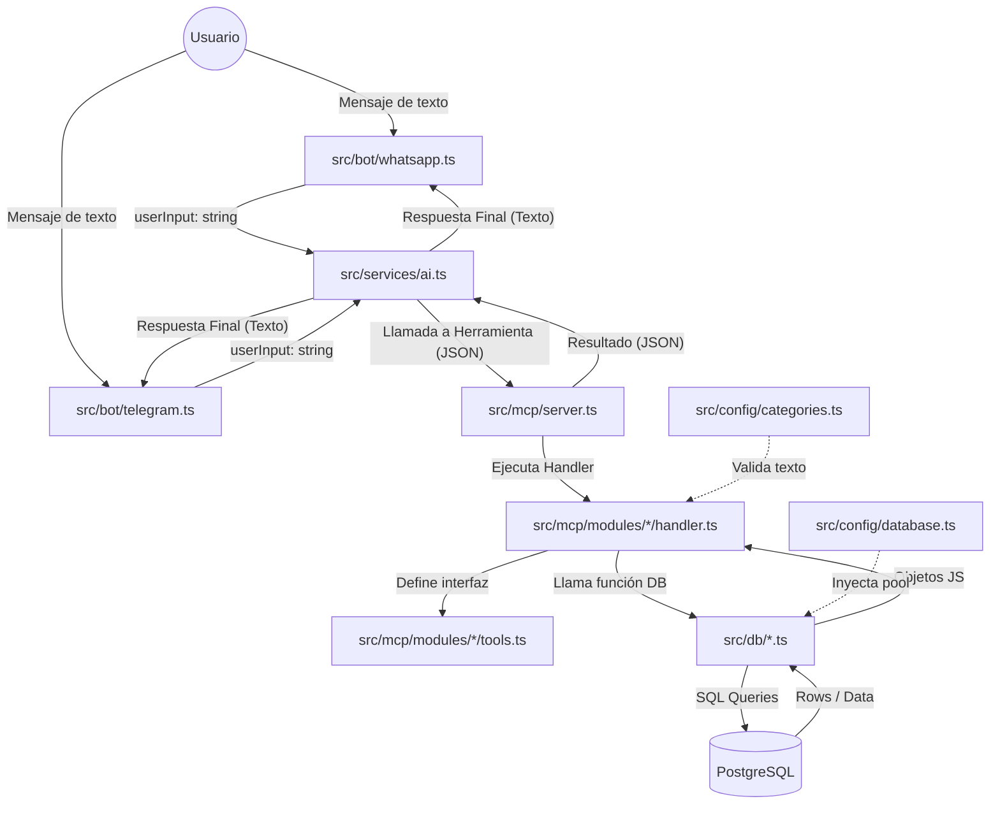

# Arquitectura del Sistema: Financial Bot

Este documento describe la estructura y el flujo de datos del proyecto para facilitar su mantenimiento y escalabilidad.

## 📊 Diagrama de Flujo Principal

## 🏗️ Capas de la Arquitectura

### 1. Capa de Interfaz (`src/bot/`)
Es la puerta de entrada. 
- **WhatsApp/Telegram**: Reciben el mensaje, lo limpian y lo pasan al `AIService`. No tienen lógica de negocio, solo comunicación.

### 2. Capa de Inteligencia (`src/services/ai.ts`)
Es el cerebro del bot.
- Utiliza **Gemini** para entender la intención del usuario.
- Decide qué herramientas llamar según lo que el usuario pida.
- **Importante**: Mantiene el historial de la conversación y refresca la fecha actual cada día.

### 3. Capa de Protocolo (MCP) (`src/mcp/`)
Actúa como un catálogo de funciones para la IA.
- **Server**: El despachador central que recibe órdenes de la IA.
- **Modules**: Carpetas organizadas por tema (Cuentas, Deudas, Transacciones).
    - `tools.ts`: El "contrato" (qué parámetros necesita la función).
    - `handler.ts`: La "ejecución" (qué hace el código realmente).

### 4. Capa de Persistencia (`src/db/`)
La única capa autorizada para tocar la base de datos PostgreSQL.
- Sigue el patrón **Repository**. Cada archivo maneja una tabla específica.

## 🔌 Conexiones (Inputs/Outputs)

| Componente | Entrada (Input) | Salida (Output) |
| :--- | :--- | :--- |
| **Bot** | Mensaje de WhatsApp/Telegram | Texto formateado |
| **AIService** | Texto del usuario | Respuesta narrativa final |
| **MCPServer** | Petición de herramienta (JSON) | Datos crudos (JSON) |
| **DB Repository** | Parámetros de función | Filas de base de datos (Arrays) |

---
*Documento generado automáticamente por Antigravity para documentación técnica.*
